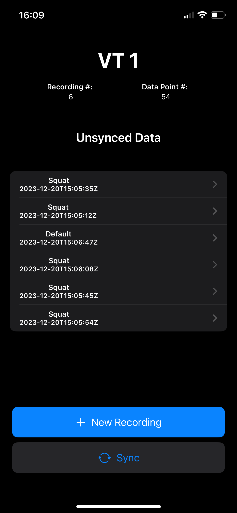
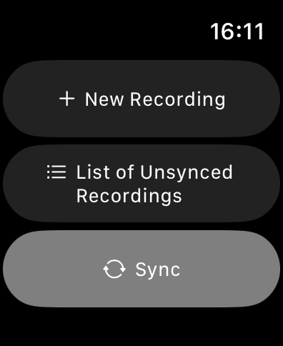
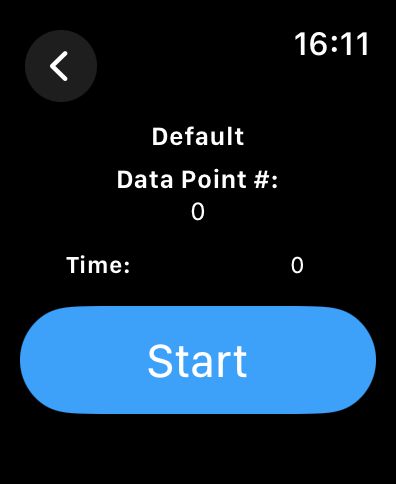

# vt1 / vt2

Project contains a watchOS and iOS Application written is Swift and a server written using Vapor.

    
    

        
         
    

## Server

[Sever Readme](./server/Readme.md)

## App

[App Readme](./app/Readme.md)
