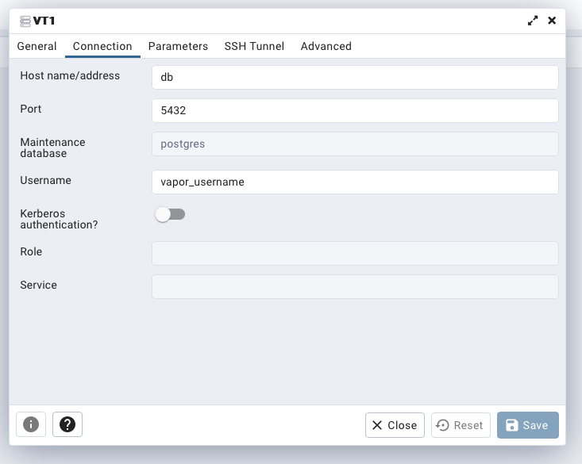

# vt1 - server

This is a server-side Swift project using Vapor framework.

## Dev

```bash
swift run App
```

### OpenApi Swagger

/swagger/index.html

### Postman

collection found ../postman

### Connect via iPhone

Make sure you iPhone and server are on the same local network.

Then run:

```bash
swift run App serve --hostname 0.0.0.0 --port 8080
```

## Prod

Make sure you have Doker installed.

Navigate to the folder that contains the docker-compose file.

Run:

```bash
docker compose up -build
```

### DB

Connect to PGAdmin

```bash
http://127.0.0.1:8888
```

Username: vapor_username@domain-name.com
PASSWORD: vapor-password

Add the server




## FAQ

## What do I do if I can't start the sever because the port is already used?

```bash
❯ lsof -i :8080
COMMAND   PID          USER   FD   TYPE             DEVICE SIZE/OFF NODE NAME
App     80913 julian.visser   16u  IPv4 0x6a20422a63379f4d      0t0  TCP *:http-alt (LISTEN)

vt1/app
❯ kill 80913
```
## How do I connect to the DB

psql -U vapor_username vapor_database
